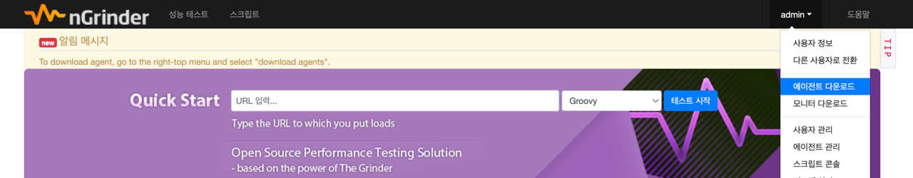
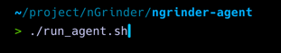
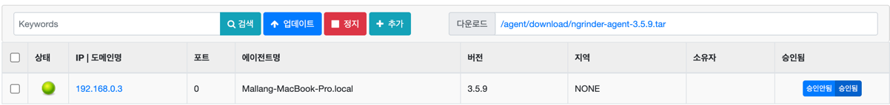
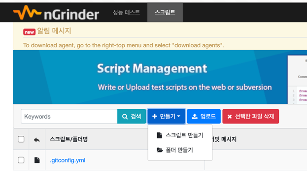
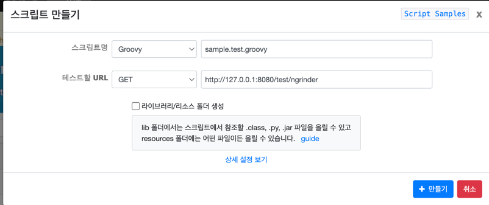

## nGrinder 설치
- nGrinder Controller 와 Agent 는 모두 로컬(내 맥북)에 설치한다.
  - 반드시 이렇게 설정해야 하는 것은 아니지만, 난 돈이 없으니까...

### nGrinder Controller 다운로드 및 실행
- https://github.com/naver/ngrinder/releases 로 가서 ngrinder-controller-{버전}.war 파일을 다운받는다.
    - 해당 테스트에서는 3.5.9 버전을 사용했다.

다운로드 완료 시 controller 를 실행해준다. (포트번호는 변경 가능하다.)
```bash
java -jar ngrinder-controller-3.5.9.war --port=8300
```

혹시 temdir 관련 문제가 발생했다면, 아래와 같이 tempDir 을 설정해 주어야 한다.
```bash
java -Djava.io.tmpdir=${NGRINDER_HOME}/lib -jar ngrinder-controller.war
```

NGRINDER_HOME은 알아서 잘 설정해주면 된다.  
```bash
java -Djava.io.tmpdir=/Users/mallang/project/ngrinder/lib -jar ngrinder-controller-3.5.9.war --port=8300

```

실행되었다면 `localhost:8300`으로 접근하자.


- 초기 아이디와 비밀번호는 admin, admin 이다.


### nGrinder Agent 다운로드 및 실행


- 다운로드가 완료되면 압축을 풀고, agent 폴더 경로로 이동한다.



에이전트를 실행한다.
```bash
./run_agent.sh
```

에이전트 실행 후 `에이전트 관리` 탭으로 들어갔을 때, 아래와 같이 초록 불과 `승인됨`이 보여지면 잘 된 것이다.



### 스크립트 작성
```groovy
import static net.grinder.script.Grinder.grinder
import static org.junit.Assert.*
import static org.hamcrest.Matchers.*
import net.grinder.script.GTest
import net.grinder.script.Grinder
import net.grinder.scriptengine.groovy.junit.GrinderRunner
import net.grinder.scriptengine.groovy.junit.annotation.BeforeProcess
import net.grinder.scriptengine.groovy.junit.annotation.BeforeThread
import org.junit.Before
import org.junit.Test
import org.junit.runner.RunWith

import org.ngrinder.http.HTTPRequest
import org.ngrinder.http.HTTPResponse
import HTTPClient.NVPair

/**
 * 1. nGrinder 테스트 스크립트 정의
 */
@RunWith(GrinderRunner)
class SampleTest {

    public static GTest test;
    public static HTTPRequest request;
    public static NVPair[] headers = [];

    /**
     * 2. 테스트 프로세스 시작 전 설정: nGrinder 테스트 프로세스가 시작되기 전에 한 번 실행되며, 테스트와 HTTP 요청 객체를 초기화함.
     */
    @BeforeProcess
    public static void beforeProcess() {
        HTTPRequestControl.setConnectionTimeout(300000)
        test = new GTest(1, "Sample Test");
        request = new HTTPRequest();
        grinder.logger.info("before process.");
    }

    /**
     * 3. 테스트 스레드 시작 전 설정: 각 nGrinder 테스트 스레드(가상 사용자)가 시작되기 전에 실행되며, 테스트 메소드의 성능 측정을 위한 설정을 함.
     */
    @BeforeThread
    public void beforeThread() {
        test.record(this, "test");
        grinder.statistics.delayReports = true;
        grinder.logger.info("before thread.");
    }

    /**
     * 4. 각 테스트 실행 전 설정: 각 테스트 실행 전에 호출되며, HTTP 요청 헤더를 설정함. 여기서는 JWT 토큰을 Authorization 헤더에 추가함.
     */
    @Before
    public void before() {
        // 만약 jwt 인증을 사용한다면 아래 주석 해제
        // headers = [new NVPair("Authorization", "Bearer {여기에 access token 작성}")];
        request.setHeaders(headers);
        grinder.logger.info("before. init headers");
    }

    /**
     * 5. 테스트 케이스 실행: 실제 테스트 로직을 실행하는 부분으로, HTTP GET 요청을 보내고 응답 상태 코드를 검증함.
     */
    @Test
    public void testRecipeDetail() {
        HTTPResponse response = request.GET("http://127.0.0.1:8080/test/ngrinder");
        assertThat(response.statusCode, is(200));
        grinder.logger.info("test passed with status code 200.");
    }
}
```

해당 스크립트 파일을 `스크립트` -> `만들기` -> `스크립트 만들기` 를 통해 생성한다.



이때 테스트할 url 에는 localhost 입력이 불가능하여 127.0.0.1 을 입력해야 한다.

스크립트 작성 후에는 `저장`한 뒤 `검증`을 진행해주면 되는데, 검증 과정에서 발생한 예외는 검색해서 알아서 해결하자..^^
