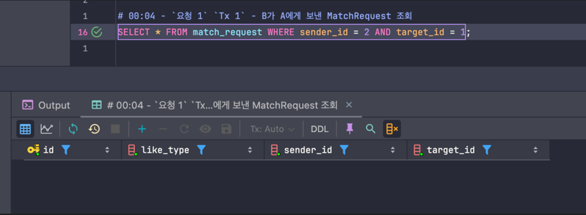

### 동시성 문제 발생하는 상황
(db의 isolation level 은 repeatable read 라 가정한다.)
##### Case 01. 매치 로직의 1, 2, 3번을 같은 트랜잭션 내에서 수행

```java
// 수도코드
@Transactional
public void match(Member sender, Member target) {
	MatchRequest matchRequest = newMatchRequest(sender, target);
	matchRequestRepository.save(matchRequest);
	if (matchRequestRepository.doesNotExistTargetLike(matchRequest)) {  
		return;
	}  
	Match match = Match.create(sender, target);
	return matchRepository.save(match);
}
```

1. 00:00 - `요청 1`  - A 가 B 에게 좋아요 요청
2. 00:01 - `요청 1` `Tx 1` - MatchRequest 저장 (sender - A, target - B)
3. 00:02 - `요청 2` - B 가 A 에게 좋아요 요청
4. 00:03 - `요청 2` `Tx 2` - MatchRequest 저장 (sender - B, target - A)
5. 00:04 - `요청 1` `Tx 1` - B가 A에게 보낸 MatchRequest 조회
    - **`요청 2` 의 트랜잭션이 commit 되지 않았으므로, 보이지 않음** → **해당 부분 테스트**
6. 00:05 - `요청 2` `Tx 2` - A가 B에게 보낸 MatchRequest 조회
    - `요청 1` 의 트랜잭션이 commit 되지 않았으므로, 보이지 않음
7. 00:06 - `요청 1` `Tx 1` - **5**의 결과, B가 A에게 보낸 MatchRequest 가 조회되지 않았으므로 Match 생성하지 않고 종료 (`Tx 1 커밋`)
8. 00:07 - `요청 2` `Tx 2` - **6** 의 결과, A가 B에게 보낸 MatchRequest 가 조회되지 않았으므로 Match 생성하지 않고 종료 (`Tx 2 커밋`)

즉 A 와 B 가 서로 좋아요 요청을 보냈지만, Match 는 생성되지 않음

---


##### Setup
```SQL
CREATE TABLE `match` (  
                         id bigint not null primary key auto_increment,  
                         match_key varchar(255) unique not null,  
                         sender_id bigint not null,  
                         target_id bigint not null  
);  
  
CREATE TABLE match_request (  
                               id bigint not null primary key auto_increment,  
                               like_type varchar(255) not null,  
                               sender_id bigint not null,  
                               target_id bigint not null  
);
```


### 테스트 진행
###### TX 1
```SQL
# A: 1, B: 2  
  
set autocommit=FALSE; # 트랜잭션 시작  
  
# 1. 00:00 - `요청 1`  - A 가 B 에게 좋아요 요청  
# 2. 00:01 - `요청 1` `Tx 1` - MatchRequest 저장 (sender - A, target - B)insert test.match_request (like_type, sender_id, target_id) values ('LIKE',1,2);  
  
  
  
  
  
  
# 5. 00:04 - `요청 1` `Tx 1` - B가 A에게 보낸 MatchRequest 조회  
SELECT * FROM match_request WHERE sender_id = 2 AND target_id = 1;  
# `요청 2` 의 트랜잭션이 commit 되지 않았으므로, 보이지 않음
```

###### TX 2
```SQL
# A: 1, B: 2  
  
set autocommit=FALSE; # 트랜잭션 시작  
  
  
  
  
  
  
# 3. 00:02 - `요청 2` - B 가 A 에게 좋아요 요청  
# 4. 00:03 - `요청 2` `Tx 2` - MatchRequest 저장 (sender - B, target - A)insert test.match_request (like_type, sender_id, target_id) values ('LIKE',2,1);  
  
  
  
  
  
# 6. 00:05 - `요청 2` `Tx 2` - A가 B에게 보낸 MatchRequest 조회  
SELECT * FROM match_request WHERE sender_id = 1 AND target_id = 2;  
# 요청 1` 의 트랜잭션이 commit 되지 않았으므로, 보이지 않음
```


5. 00:04 - `요청 1` `Tx 1` - B가 A에게 보낸 MatchRequest 조회
    - **`요청 2` 의 트랜잭션이 commit 되지 않았으므로, 보이지 않음**
```SQL
# 00:04 - `요청 1` `Tx 1` - B가 A에게 보낸 MatchRequest 조회  
SELECT * FROM match_request WHERE sender_id = 2 AND target_id = 1;
```

결과

- 예상대로 보이지 않음


### 참고
- 1. 만약 REPEATABLE READ 상태에서 `TX1` 이 read 전에 `TX2` 가  commit 이 되었다면 보일까?
    - 예측: 보인다. 왜냐하면 REPEATABLE READ 는 한 트랜잭션에서 읽기의 일관성을 맞춰주는 것이므로, 아래 조건을 만족한다면 보일 것이다.
        - TX1 은 TX2 가 commit  되기 전에, TX2 가 커밋 전에 변경한 table을 SELECT 하지 않아야 함.
    - 결과: 보인다!
      (# 은 실행 순서)
```SQL
# 1 (TX 1 시작)  
set autocommit=FALSE; # 트랜잭션 시작  
  
  
# 3  
insert test.match_request (like_type, sender_id, target_id) values (  
          'LIKE',1,2);  
  
  
# 6 (TX 2 커밋 이후 읽기)  
SELECT * FROM match_request WHERE sender_id = 2 AND target_id = 1;  
# `요청 2` 의 트랜잭션이 commit 되어서 보임!
```

```SQL
# 2 (TX 2 시작)  
set autocommit=FALSE; # 트랜잭션 시작  
  
# 4  
insert test.match_request (like_type, sender_id, target_id) values (  
                                                                       'LIKE',2,1);  
  
# 5 (TX2 커밋)  
commit;
```


- 1-1 : 당연하게도,  아래와 같이 TX 1 이 두 번 읽으면 보이지 않는다.
```SQL
# 1 (TX 1 시작)  
set autocommit=FALSE; # 트랜잭션 시작  
  
  
# 3  
insert test.match_request (like_type, sender_id, target_id) values (  
          'LIKE',1,2);  
  
  
  
# 5 (TX 2 커밋 이전 읽기)  
SELECT * FROM match_request WHERE sender_id = 2 AND target_id = 1;  
# `요청 2` 의 트랜잭션이 commit 되지 않아 보이지 않음  
  
  
  
  
  
# 7 (TX 2 커밋 이후 읽기)  
SELECT * FROM match_request WHERE sender_id = 2 AND target_id = 1;  
# `요청 2` 의 트랜잭션이 commit 되었으나, REPEATABLE READ 이므로 5에서 읽은 것으로 인해 읽히지 않음.
```

```SQL
# 2 (TX 2 시작)  
set autocommit=FALSE; # 트랜잭션 시작  
  
  
  
# 4  
insert test.match_request (like_type, sender_id, target_id) values (  
                                                                       'LIKE',2,1);  
  
# 6 (TX2 커밋)  
commit;
```


- 1-2 : 만약 TX1 에서 TX2 가 커밋 전에 변경시킨 다른 테이블을 읽는다면?
    - 그렇다면 보이지 않을 것임.

```SQL
# 1 (TX 1 시작)  
set autocommit=FALSE; # 트랜잭션 시작  
  
  
# 3  
insert test.match_request (like_type, sender_id, target_id) values ('LIKE',1,2);  
insert test.match (match_key, sender_id, target_id) values ('1',1,2);  
  
  
  
# 5 (TX 2 커밋 이전 읽기)  
SELECT * FROM `match` where match_key='2';  
# 안읽힘  
  
  
# 7  
SELECT * FROM match_request where sender_id=2;  
# 위에서 match 테이블을 읽었기에 읽히지 않음.  
  
```

```SQL
# 2 (TX 2 시작)  
set autocommit=FALSE; # 트랜잭션 시작  
  
  
  
# 4  
insert test.match_request (like_type, sender_id, target_id) values ('LIKE',2,1);  
insert test.match (match_key, sender_id, target_id) values ('2',2,1);  
  
# 6 (TX2 커밋)  
commit ;
```


- 2. 만약 READ_UNCOMMITED 상태에서는 보일까?
    - 예측: 보인다.
    - 결과: 보인다.
```SQL
# 1 (TX 1 시작)  
set TRANSACTION ISOLATION LEVEL READ UNCOMMITTED;  
set autocommit=FALSE; # 트랜잭션 시작  
  
  
# 3  
insert test.match_request (like_type, sender_id, target_id) values ('LIKE',1,2);  
  
  
  
  
# 5  
SELECT * FROM match_request where sender_id=2;  
# 보임
```


```SQL
# 2 (TX 2 시작)  
set TRANSACTION ISOLATION LEVEL READ UNCOMMITTED ;  
set autocommit=FALSE; # 트랜잭션 시작  
  
  
  
# 4  
insert test.match_request (like_type, sender_id, target_id) values ('LIKE',2,1);
```
