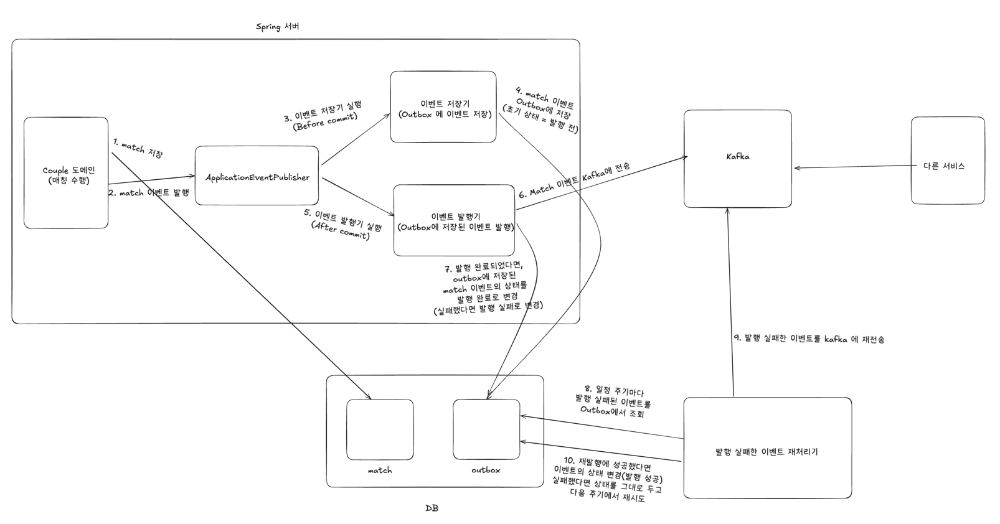

전체 시스템 구성도는 위와 같다.
- 1. Couple 도메인은 매칭 수행 후, 매칭에 성공했다면 match 정보를 DB 에 저장한다.
- 2. 이후 ApplicationEventListener 를 사용하여 매치 성공 이벤트를 발행한다.
- 3. 이벤트 저장기는 트랜잭션 커밋 전(BEFORE_COMMIT) 실행되며
    - 4.  발행된 이벤트를 outbox 테이블에 저장한다.
- (커밋 완료)
- 5. 커밋 이후, 이벤트 발행기가 실행되어
    - 6. 매치 성공 이벤트를 카프카에 전송한다.
    - 7. 발행이 완료되었다면 이벤트의 상태를 발행 완료로, 실패했다면 발행 실패로 기록한다.
- 8. 발행에 실패한 이벤트는 일정 주기마다 이벤트 재처리기에서 조회하여 재전송을 시도한다.

이때 다음과 같은 추가적인 문제점이 하나 생길 수 있다.
- 이벤트 발행에 성공했지만, 발행 상태를 변경하는 트랜잭션이 모종의 이유로 실패한다면, 발행이 완료되었으나 발행 상태가 `미발행` 혹은 `발행실패` 로 계속 남아있을 수 있다.
- 발행 상태가 `미발행` 혹은 `발행실패`로 남아있게 되면, 이벤트 재처리기에 의해 동일한 이벤트가 중복 produce 되는 문제가 발생한다.

이 문제를 해결하기 위해 이벤트를 **소비(Consume)** 하는 로직을 **멱등**(**Idempotent**)하게 설계해야 한다.
이는 [[03-3. 멱등한 Consumer 설계]] 를 참고하자.
