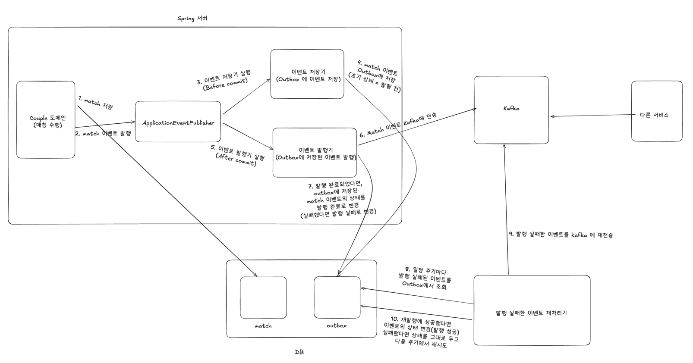

전체 시스템 구성도는 위와 같다.
- 1. Couple 도메인은 매칭 수행 후, 매칭에 성공했다면 match 정보를 DB 에 저장한다.
- 2. 이후 ApplicationEventListener 를 사용하여 매치 성공 이벤트를 발행한다.
- 3. 이벤트 저장기는 트랜잭션 커밋 전(BEFORE_COMMIT) 실행되며
    - 4.  발행된 이벤트를 outbox 테이블에 저장한다.
- (커밋 완료)
- 5. 커밋 이후, 이벤트 발행기가 실행되어
    - 6. 매치 성공 이벤트를 카프카에 전송한다.
    - 7. 발행이 완료되었다면 이벤트의 상태를 발행 완료로, 실패했다면 발행 실패로 기록한다.
- 8. 발행에 실패한 이벤트는 일정 주기마다 이벤트 재처리기에서 조회하여 재전송을 시도한다.

---

### 데이터의 중복 Produce 문제

이때 다음과 같은 추가적인 문제점이 하나 생길 수 있다.
- 이벤트 발행에 성공했지만, 발행 상태를 변경하는 트랜잭션이 모종의 이유로 실패한다면, 발행이 완료되었으나 발행 상태가 `미발행` 혹은 `발행실패` 로 계속 남아있을 수 있다.
- 발행 상태가 `미발행` 혹은 `발행실패`로 남아있게 되면, 이벤트 재처리기에 의해 동일한 이벤트가 중복 produce 되는 문제가 발생한다.

이 문제를 해결하기 위해 이벤트를 **소비(Consume)** 하는 로직을 **멱등**(**Idempotent**)하게 설계해야 한다.
이는 [[03-3. 멱등한 Consumer 설계]] 를 참고하자.

---

### 이벤트의 순서

#### 이벤트의 순서가 보장되어야 하는 경우

이벤트 발행기를 설계할 때, 이벤트의 발행 순서가 반드시 보장되어야 하는 경우와 그렇지 않은 경우를 구분할 필요가 있다.

예를 들어, 결제 후 환불과 같은 시나리오에서는 이벤트 순서가 중요하다. 
결제 이벤트가 먼저 발생하고 그 이후에 환불 이벤트가 발생해야 한다. 
하지만 만약 환불 이벤트가 먼저 도착한다면, 사용자 입장에서 다음과 같은 잘못된 알림이 발생할 수 있다.
- "환불이 완료되었습니다."
- "결제가 완료되었습니다."

이 경우, 단순히 알림 순서가 잘못된 것뿐만 아니라, 후속 처리(예: 회계 시스템 연동, 포인트 지급/회수 등)가 엉뚱한 순서로 진행될 가능성이 있다. 
따라서 이벤트 발행 순서를 보장하거나, 이벤트를 소비하는 측에서 올바른 순서로 처리하는 로직이 필요하다.

(다만 현재 서비스에서는 반드시 순차적으로 처리해야 하는 이벤트가 없으므로, 향후 필요할 경우 이에 대한 해결 방안을 고민할 예정이다.)

#### 이벤트의 순서가 보장되지 않아도 되는 경우

반면, 이벤트의 순서가 중요한 역할을 하지 않는 경우도 있다. 
예를 들어, 매칭 성공 이벤트는 특정한 순서로 처리될 필요가 없다.

A-B 매칭, A-C 매칭이 발생했을 때, C와의 매칭 알림이 먼저 오더라도 문제되지 않는다.

이러한 이벤트는 발행 순서와 관계없이 독립적으로 처리할 수 있으므로, 별도의 순서 보장 로직이 필요하지 않다.

이를 바탕으로 이벤트 발행기에 대한 설계는 [[03-4. 이벤트 발행기 설계]]를 참고하자.

---

### 이벤트에 들어갈 정보
이벤트 발행 시 포함할 정보는 크게 두 가지 방식으로 나뉜다.
- 1. 이벤트를 처리하는 데 필요한 모든 정보 제공
- 2. 이벤트의 **식별자**(예: 커플 ID)와 최소한의 정보만 제공 (Zero-Payload 방식)

현재 서비스에서는 Zero-Payload 방식을 기본적으로 채택하고자 한다. 그 이유는 다음과 같다.

그 이유는 다음과 같다.
- 1. 유연한 스키마 관리
  - 만약 이벤트를 처리하는 데 필요한 모든 정보를 제공하는 경우, 필드가 추가되거나 제거될 때 컨슈머가 새로운 이벤트 구조를 이해하지 못하는 문제가 발생할 수 있다. 
  - 스키마 레지스트리를 활용하면 해결할 수 있지만, 운영 부담이 증가한다.
- 2. 변경 비용 절감
  - 필요한 데이터가 추가될 때마다 이벤트 구조를 수정하고 배포해야 하는 부담이 줄어든다.
- 3. 데이터 발행 순서 
  - 이벤트 자체에 변경된 데이터를 포함하면, 이벤트의 순서가 어긋났을 때 일관성 문제가 발생할 수 있다.
  - 대신 이벤트를 처리하는 서비스가 API를 호출하여 최신 상태를 조회하면, 항상 신뢰할 수 있는 최신 데이터를 활용할 수 있다

따라서 현재 시스템에서는 Zero-Payload 방식을 유지하며,
추후 Zero-Payload 방식을 사용함으로써 문제가 발생하는 이벤트가 생길 경우, 
이에 대한 해결 방안을 고민할 예정이다.
