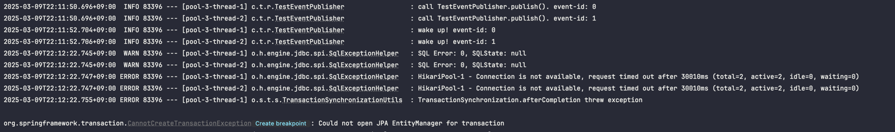
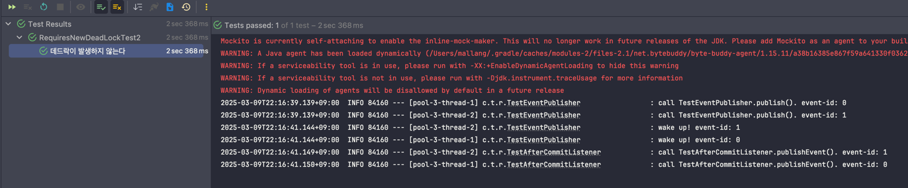

# 테스트
(경로 - `test/java/cupid/test/requiresnewdeadlock`)
테스트는 2개의 스레드에서 진행한다.

## 1. 데드락 발생 테스트
우선 hikariCP 설정을 다음과 같이 진행한다.
- MaximumPoolSize = 2 (데드락을 피할 수 있는 최소 pool size 공식: Tn x (cm - 1) + 1 에서 1을 뺀 값)
```yaml
spring:
  config:
    activate:
      on-profile: requiresnewdeadlock1
  datasource:
    hikari:
      maximum-pool-size: 2            # 최대 커넥션 수
      connection-timeout: 30000       # 커넥션을 가져올 때 대기할 최대 시간 (밀리초)
      max-lifetime: 1800000           # 커넥션이 유지될 최대 시간 (밀리초)
```

이벤트 리스너는 다음과 같다.
```java
@Service
public class TestAfterCommitListener {
    
    private final Logger log = LoggerFactory.getLogger(TestAfterCommitListener.class);
  
    @Transactional(propagation = Propagation.REQUIRES_NEW)
    @TransactionalEventListener(phase = TransactionPhase.AFTER_COMMIT)
    public void publishEvent(TestEvent event) {
      log.info("call TestAfterCommitListener.publishEvent(). event-id: {}", event.getId());
    }
}
```

이후 다음 코드를 두 스레드에서 동시에 실행한다.
```java
@Transactional
public void publishEvent(TestEvent event) {
  log.info("call TestEventPublisher.publish(). event-id: {}", event.getId());
  // 2 초간 대기
  try {
    Thread.sleep(2000);
  } catch (InterruptedException e) {
    throw new RuntimeException(e);
  }
  log.info("wake up! event-id: {}", event.getId());
  publisher.publishEvent(event);
}
```

데드락 발생 시나리오는 다음과 같다.
- 00:00.001 : 스레드 1에서 login 실행 -> TX 획득(커넥션 1개 소모, 잔여 커넥션 수 1개) -> 2초 대기
- 00:00.002 : 스레드 2에서 login 실행 -> TX 획득(커넥션 1개 소모, 잔여 커넥션 수 1개) -> 2초 대기
- 00:02.001 : 스레드 1에서 publisher.publishEvent(event); 실행 -> TestAfterCommitListener.publishEvent 호출 -> 새로운 트랜잭션 획득 요청 -> 잔여 커넥션이 없으므로 대기
- 00:02.002 : 스레드 2에서 publisher.publishEvent(event); 실행 -> TestAfterCommitListener.publishEvent 호출 -> 새로운 트랜잭션 획득 요청 -> 잔여 커넥션이 없으므로 대기
-> 데드락!

다음은 테스트 코드이다.
```java
    @Test
    void 데드락이_발생한다() {
        // given
        ExecutorService executorService = Executors.newFixedThreadPool(2);

        // when
        for (long i = 0; i < 2; i++) {
            final long id = i;
            executorService.submit(() -> {
                testEventPublisher.publishEvent(new TestEvent(id));
            });
        }
    }
```

### 실제 결과

위와 같이 데드락이 발생한 것을 알 수 있다.


---

## 2. 데드락 발생 예방 테스트
- 스레드 개수 2개
- MaximumPoolSize = 3 (데드락을 피할 수 있는 최소 pool size 공식: Tn x (cm - 1) + 1)

```yaml
spring:
  config:
    activate:
      on-profile: requiresnewdeadlock2
  datasource:
    hikari:
      maximum-pool-size: 3            # 최대 커넥션 수
      connection-timeout: 30000       # 커넥션을 가져올 때 대기할 최대 시간 (밀리초)
      max-lifetime: 1800000           # 커넥션이 유지될 최대 시간 (밀리초)
```
이제 1에서와 동일한 코드를 실행시켜보자.

### 실제 결과



위와 같이 데드락이 발생하지 않은 것을 확인할 수 있다.
