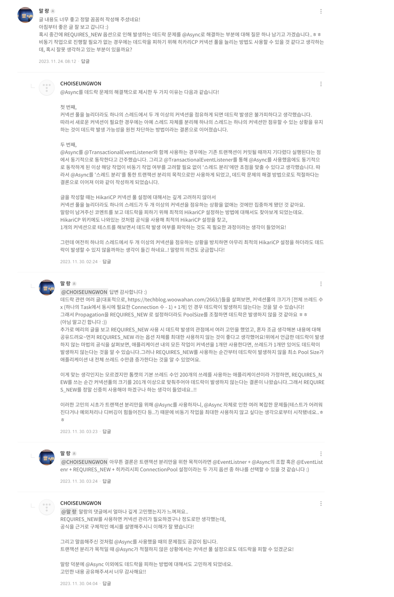

# 이벤트 발행기 설계

트랜잭션 커밋 이후, 이벤트를 발행할 때 다음과 같은 방법이 있다.
- 1. `REQUIRES_NEW` 를 사용하여, 같은 스레드에서 동기적으로 처리한다.
- 2. @Async 를 통해 비동기 처리를 진행한다.
   - 2.1 비동기 스레드를 싱글 스레드로 설정
   - 2.2 비동기 스레드가 스레드 풀을 사용하도록 설정
   - 2.3 비동기 스레드가 가상 스레드를 사용하도록 설정.

### 1. `REQUIRES_NEW` 를 사용하여, 같은 스레드에서 동기적으로 처리한다.
`REQUIRES_NEW` 를 사용해야 하는 이유는 다음과 같다.
- @TransactionalEventListener(phase = TransactionPhase.AFTER_COMMIT) 를 사용하게 되면, 해당 메서드는 트랜잭션은 커밋되었으나 종료되지 않은 상태로 호출되게 된다.
  - 즉 트랜잭션이 커밋된 이후 리스너가 동작한다고 해도, 여전히 하나의 트랜잭션에 묶여있는 것이다.
- 따라서 해당 메서드 내에서 트랜잭션 작업이 이어지는 경우, 이미 커밋된 트랜잭션 내에서의 변경 작업이기 때문에 해당 작업 내용은 commit되지 않고 사라진다.
- 따라서 이를 해결하기 위해서는 완전히 새로운 트랜잭션을 만들어줘야 하는데, 이를 위해 propagation 속성을 `REQUIRES_NEW` 로 설정해야 한다. 
- 좀 더 자세한 내용은 [@TransactionalEventListener 호출 시 발생하는 문제](https://ttl-blog.tistory.com/1130)를 통해 확인할 수 있다.

그런데 `REQUIRES_NEW` 를 사용하게 되면, 데드락 발생 가능성이 생길 것이다.
왜냐하면 [HikariCP Dead lock에서 벗어나기 (이론편)](https://techblog.woowahan.com/2664/) 을 참고하면 알 수 있듯이, 
한 Transaction에서 동시에 Connection 2개를 사용하게 되면 Thread 간 Dead lock이 발생할 수 있기 때문이다.

@TransactionalEventListener(phase = TransactionPhase.AFTER_COMMIT) 을 통해 트랜잭션 커밋 이후 리스너가 동작하더라도,
해당 트랜잭션에 대한 커넥션이 완전히 반환되지 않은 상태에서, `REQUIRES_NEW` 로 새로운 트랜잭션을 만들게 되면, 
하나의 스레드에드에서 트랜잭션을 진행하는 동안 두개의 커넥션이 맺어지게 되므로 스레드 간 데드락이 발생할 수 있다.

[[03-4-1. REQUIRES_NEW 사용 시 데드락 테스트.md]] 에서 테스트를 진행했고, 예상과 같이 스레드 간 데드락이 발생한 것을 확인할 수 있었다.

그렇다면 `REQUIRES_NEW` 방식은 사용해서는 안되는 것일까?

-> 그것은 아니다.
데드락이 발생하지 않도록 hikariCP 커넥션 풀 사이즈의 최대 개수를 늘려주면 된다.
공식은 다음과 같은데(pool size = Tn x (Cm - 1) + 1) 이다.
- Tn : 전체 스레드 개수
- Cm : 하나의 Task 에서 동시에 필요한 Connection 수

그러나 위 공식에서 알 수 있듯이, `REQUIRES_NEW` 를 사용하지 않으면, 현재 서비스 상 Task 에서 동시에 필요한 Connection 수는 1개이므로,
pool Size의 최소 크기는 1이면 된다.

그러나 `REQUIRES_NEW`를 사용하는 순간, 데드락 발생 방지를 위해 필요해지는 최소 커넥션의 수가 `전체 스레드 개수` + 1 이 되어,  
201개가 될 것이다. (톰캣의 기본 스레드풀 개수가 200개임)  
(근데 이건 너무 많은 것 같다.. ㅠㅠ)

(잡설: 이러한 내용을 이전부터 생각만 하고, 직접 테스트 해보지는 않았는데, 이번에 테스트하고 확인하니 홀가분했음..ㅎㅎ
)

---

### 2. @Async 를 통해 비동기 처리를 진행한다.
@Async 를 통해 다른 스레드를 사용하여 비동기적으로 처리하게 되면,
스레드가 달라지기 때문에 1번에서의 문제는 더이상 발생하지 않게 된다.
따라서 @Async 를 사용하는 것이 더 나은 방안이라 생각하였다.

그런데 @Async 를 사용할 때에도, 비동기로 작업을 처리할 스레드를 어떻게 설정할 것인지에 대해 고민해야 한다.
지금 생각나는 방법들로는 다음과 같은 방법들이 있고, 각 방식의 특징과 장단점을 비교해가며 선택하는 과정이 필요해 보인다.
- 2.1 비동기 스레드를 싱글 스레드로 설정
- 2.2 비동기 스레드가 스레드 풀을 사용하도록 설정
- 2.3 비동기 스레드가 가상 스레드를 사용하도록 설정.

이에 대한 내용은 [03-4-2. 비동기 이벤트 발행기 ]을 참고하자.
